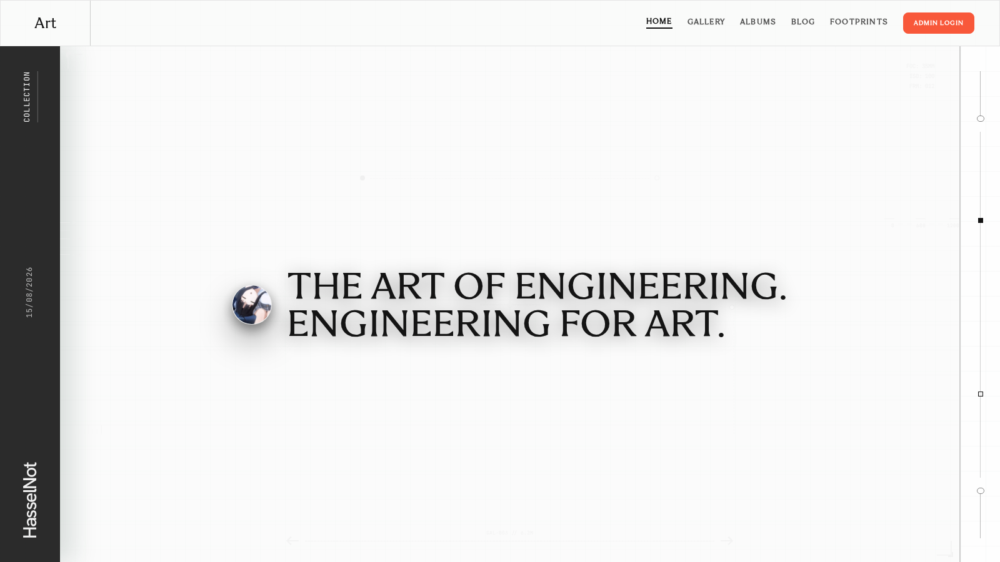
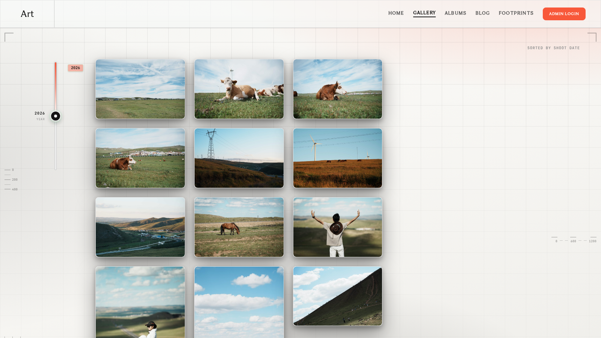
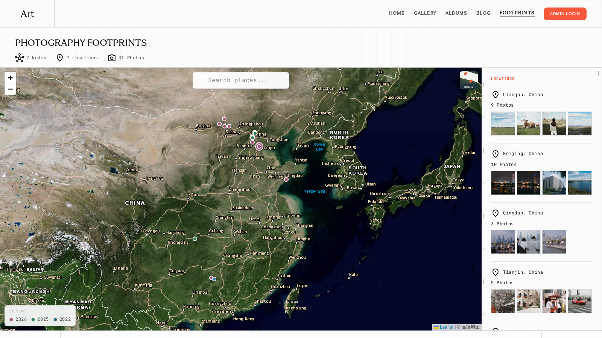
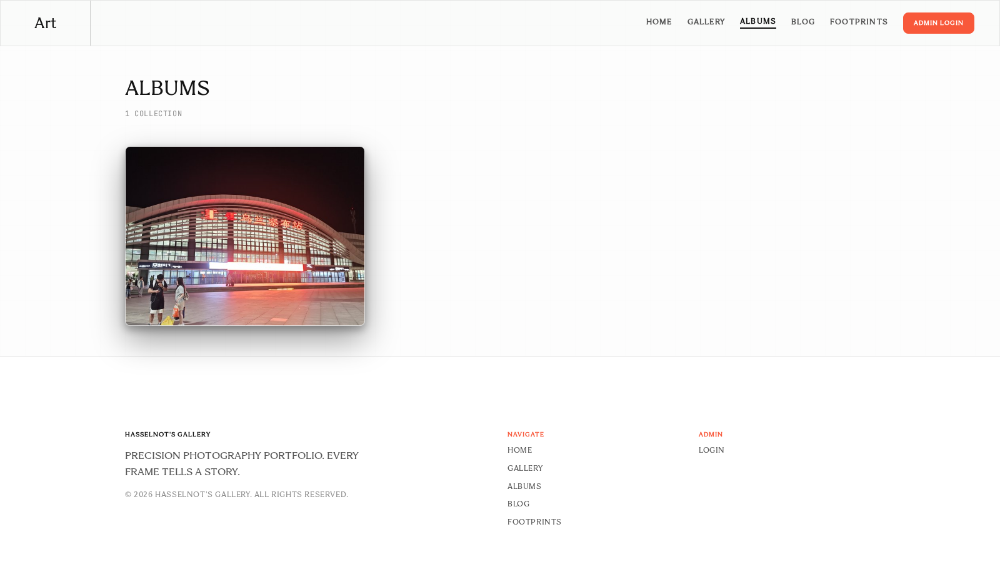
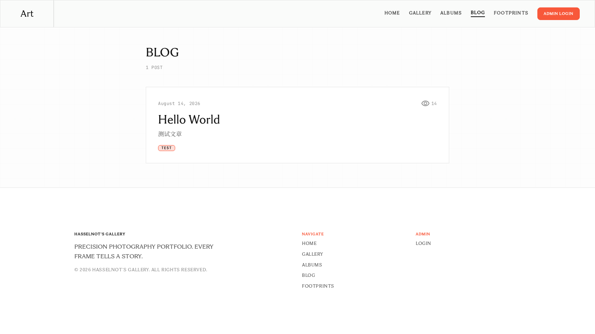
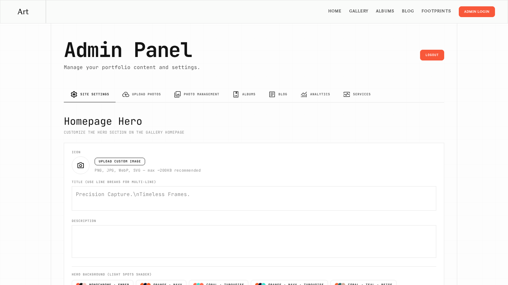

# Lens & Light — Photography Portfolio

个人摄影作品集与博客 / Personal photography portfolio & blog

基于 Next.js 16 + FastAPI 的个人摄影作品网站与博客。黑白配色 + 水墨波纹背景，支持照片画廊、足迹地图、博客、评论、访问统计与 Cloudflare R2 存储。

Built with Next.js 16 + FastAPI. A monochrome theme with ink-wash ripple background, featuring photo gallery, footprints map, blog, comments, visit analytics and Cloudflare R2 storage.

---

## 截图 / Screenshots

| | |
|---|---|
|  |  |
|  |  |
|  |  |

---

## 功能 / Features

**中文**

- **首页**：动态光斑 WebGL 背景（管理员可调 11 种配色预设）+ 水墨波纹全站背景 + 品牌 Hero
- **画廊**：瀑布流 + 全量年份时间线跳转 + 灯箱大图浏览（键盘导航）+ 无限滚动懒加载
- **相册**：按主题/旅行地分组，独立专辑页
- **足迹地图**：全屏 Leaflet 地图，标记按年份配色，地名搜索，8 种底图切换（anitabi 风格缩略图选择器）
- **照片详情**：EXIF 面板、浏览量、评论、位置编辑（管理员可在地图上拖拽设置/复原拍摄地点）
- **博客**：Markdown 写作（后台管理），列表 + 详情页，标签、浏览量、评论
- **管理后台**：站点设置、批量上传（浏览器端压缩 + EXIF/GPS 保留）、照片/相册/文章管理、访问分析（PV/UV、热门内容）
- **SEO**：sitemap.xml、robots.txt、OG 标签
- **存储**：Cloudflare R2（S3 兼容），未配置时回退本地；重复图片检测（SHA256）
- **备份**：每日自动备份数据库与配置到 R2 私有桶（见 `scripts/README.md`）

**English**

- **Home**: Animated WebGL gradient background (11 color presets configurable in admin) + ink-wash ripple background + brand hero
- **Gallery**: Masonry layout, full-year timeline jump, lightbox with keyboard navigation, infinite scroll with lazy loading
- **Albums**: Grouped by theme / trip, with standalone album pages
- **Footprints Map**: Fullscreen Leaflet map, year-colored markers, place search, 8 basemap styles (anitabi-style thumbnail picker)
- **Photo Detail**: EXIF panel, view count, comments, location editing (admin can drag markers on the map)
- **Blog**: Markdown authoring in admin, list + detail pages, tags, views, comments
- **Admin**: Site settings, batch upload (in-browser compression, EXIF/GPS preserved), photo/album/article management, analytics (PV/UV, top content)
- **SEO**: sitemap.xml, robots.txt, OG tags
- **Storage**: Cloudflare R2 (S3-compatible) with local fallback; duplicate detection (SHA256)
- **Backup**: Daily automated database & config backup to a private R2 bucket (see `scripts/README.md`)

---

## 技术栈 / Tech Stack

| 层 Layer | 技术 Tech |
|---|---|
| 前端 Frontend | Next.js 16（App Router + Turbopack）、Tailwind CSS v4、Leaflet、Three.js |
| 后端 Backend | FastAPI（Python 3.13）、SQLAlchemy、SQLite |
| 图片 Images | Pillow（EXIF/缩略图）、piexif（EXIF 注入）、python-markdown |
| 存储 Storage | Cloudflare R2（boto3） |
| 字体 Fonts | Sigma Serif / JetBrains Mono / Noto Serif SC（思源宋体） |

---

## 快速开始 / Quick Start

```bash
# 后端 Backend (Python 3.13)
cd backend
python3 -m venv .venv
.venv/bin/pip install -r requirements.txt
cp .env.example .env        # 填入 R2 配置（可选） / Fill in R2 config (optional)
ADMIN_PASSWORD=你的密码 .venv/bin/python init_db.py   # 创建管理员 / Create admin
.venv/bin/uvicorn main:app --host 127.0.0.1 --port 8001

# 前端 Frontend (Node 20+)
cd frontend
npm install
echo "NEXT_PUBLIC_SITE_URL=http://localhost:3000" > .env.local
npm run dev
```

访问 `http://localhost:3000`，后台入口 `/admin`。

Visit `http://localhost:3000`, admin at `/admin`.

---

## 对象存储 / Object Storage (Cloudflare R2)

照片存储于 R2（原图 + 缩略图），服务器不保存照片文件。配置见 `backend/.env.example`：

Photos are stored in R2 (original + thumbnail); no photo files on the server. See `backend/.env.example`:

```bash
R2_ACCOUNT_ID=Cloudflare账户ID（32位十六进制）/ Cloudflare account ID (32 hex chars)
R2_ACCESS_KEY_ID=R2 API Token Access Key
R2_SECRET_ACCESS_KEY=R2 API Token Secret
R2_BUCKET=gallery
R2_PUBLIC_URL=https://pub-xxxx.r2.dev   # r2.dev 子域或自定义域名 / subdomain or custom domain
```

存量照片迁移 / Migrate existing photos: `cd backend && .venv/bin/python backfill_r2.py --delete-local`

> 未配置 R2 时自动回退本地 `backend/uploads/` 存储。
> Falls back to local `backend/uploads/` when R2 is not configured.

---

## 目录结构 / Directory Structure

```
backend/                # FastAPI 后端 / Backend
├── main.py             # 入口 / Entry
├── routes/             # auth / photos / articles / albums / comments
├── storage.py          # R2 存储层 / Storage layer
├── init_db.py          # 建表 + 创建管理员 / Init DB + create admin
└── *.py                # 工具脚本 / Utility scripts
frontend/               # Next.js 前端 / Frontend
├── app/                # 页面 / Pages (home/gallery/albums/blog/map/admin)
├── components/         # 组件 / Components (lightbox, map, comments, timeline...)
└── lib/                # API 客户端、地图图层、站点配置 / API client, map layers, site config
scripts/README.md       # 备份脚本说明 / Backup script docs
docs/DEPLOY.md          # 部署指南 / Deployment guide (systemd + nginx + HTTPS)
PROJECT.md              # 项目文档 / Project docs
```

---

## 部署 / Deployment

完整部署步骤（systemd + nginx + HTTPS）见 [`docs/DEPLOY.md`](docs/DEPLOY.md)。要点 / Highlights：

- 代码 + `backend/gallery.db` + `backend/.env`（密钥）三件套迁移 / migrate code + db + secrets
- 环境变量：`NEXT_PUBLIC_SITE_URL`（站点域名）、`JWT_SECRET_KEY`（生产务必设置 / required in production）
- 照片本体在 R2，迁移服务器无需搬运图片 / photos live in R2, no need to move images

---

## 许可 / License

仅个人使用。照片版权归作者所有。

For personal use only. All photo copyrights belong to the author.
